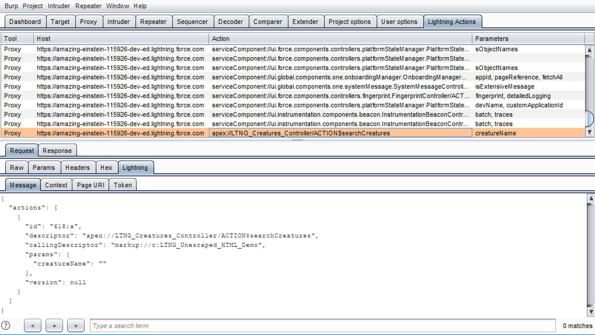
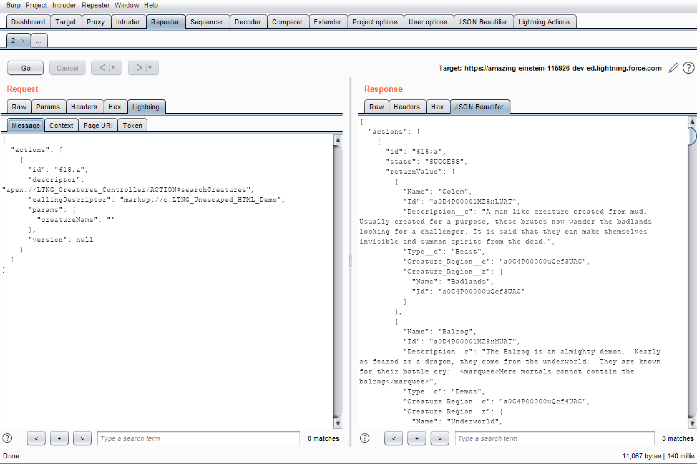

# Lightning Action Editor
A Burp Suite extension for manual testing of Lightning Web Components.

## Screenshots

The "Lightning Actions" tab includes all identified server side actions. Requests are simplified to contain only a single action and can be sent to repeater and intruder.

The "Lightning" tab parses requests for viewing and editing throughout Burp Suite.